Hey there. 
A couple of months ago, I build my new handwired mechanical keyboard.  
Here is the final:

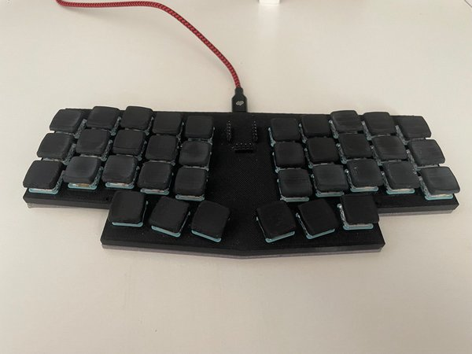

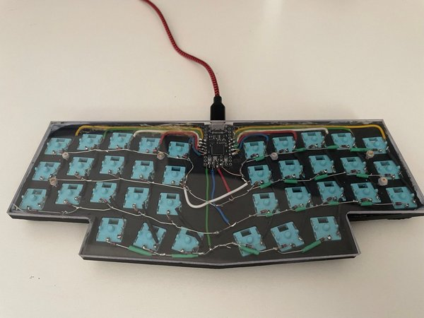

This keyboard is my second handwired keyboard. Today, I want to talk about the physical part of this keyboard.  
This keyboard is a coalescence of the left and right parts of the [corne](https://github.com/foostan/crkbd) keyboard (a split keyboard). I preferred a single body for this layout. Since this is a custom keyboard, I needed to design a 3D file by myself. I found [this 3D file](https://www.thingiverse.com/thing:4911460) from Thingiverse, and I merged them and filled the spaces on [Tinkercad](https://www.tinkercad.com/).  

After a long tussling over, the final result was this:  

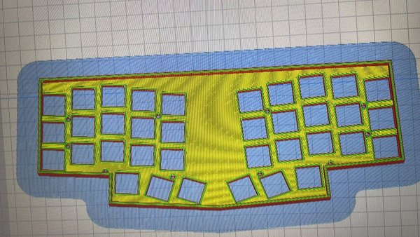

Then I printed with my `Artillery Sidewinder-x2` 3D printer.

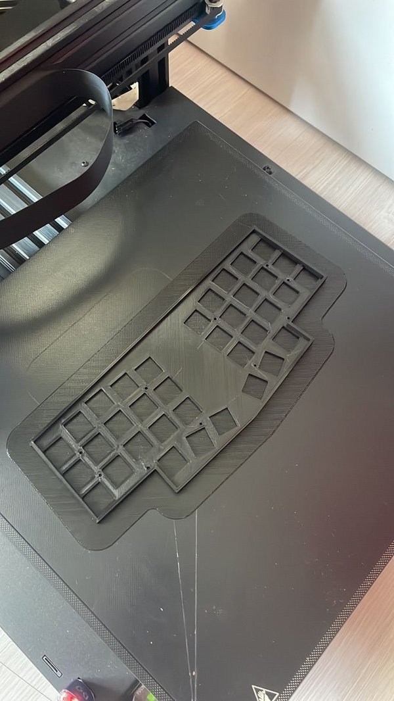

I used `Kailh Choc Robin` switches. When I put all switches into the plate, it looked like this: 

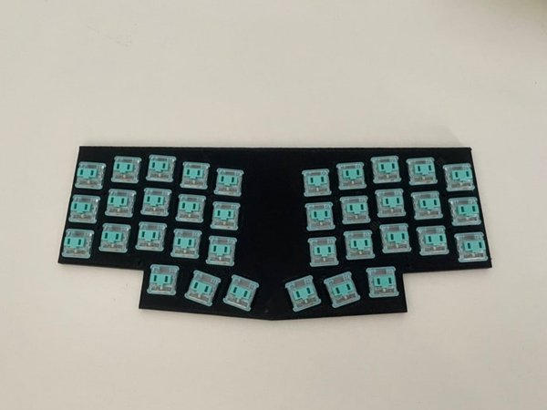

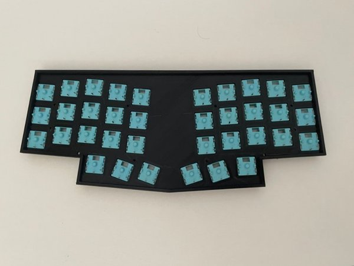

As you can see here, on the back, each switch has 2 metal pins. Basicly, what I need to do is, connecting the pins of switches by columns and rows.  
I started with columns. I glued wires like below:

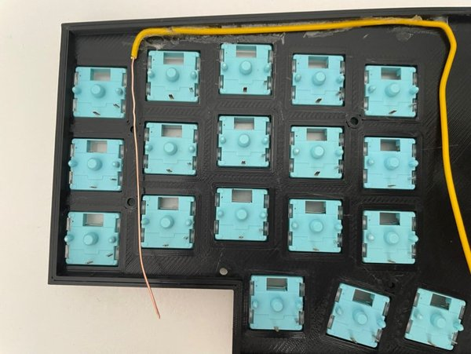

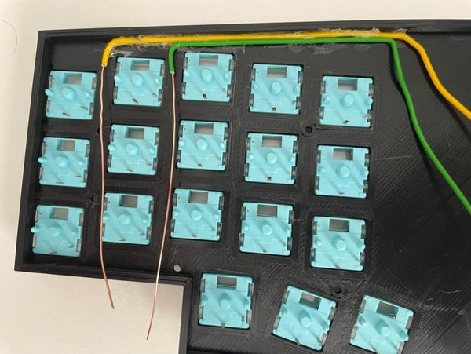

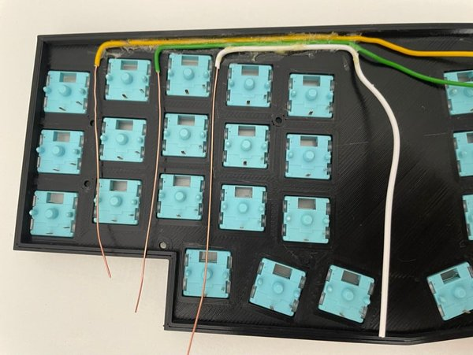

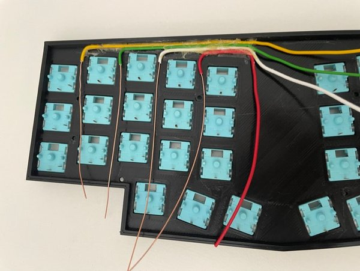

After placing the wire, I bended the wire to solder easily.  

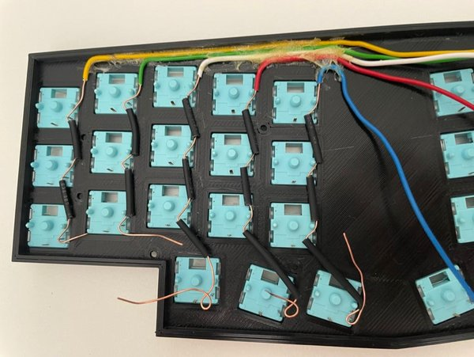

The heat shrink tubes are for preventing shorts on intersections of columns and rows.

Then I prepared the diodes to connect row.  
Why diode? To prevent the shorts while pressing multiple keys the same time.  

I did bend one leg of each diode. Because with this way, I can solder a diode to switch easily.

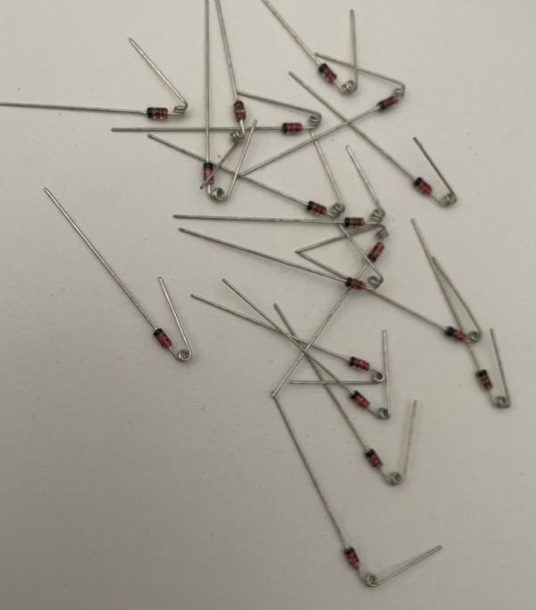

Huge thanks to my gorgeous wife. She did all soldering.  
After soldering left part, it looked like this: 

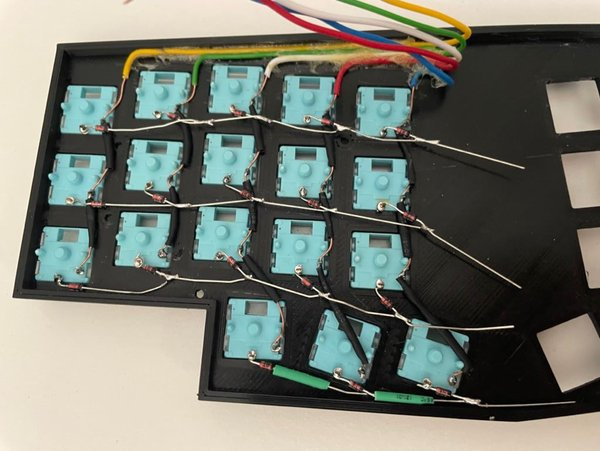

Same process was applied to right part.  

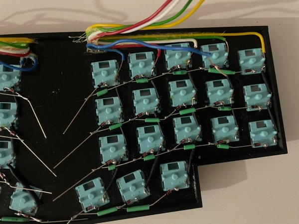

After soldering:  

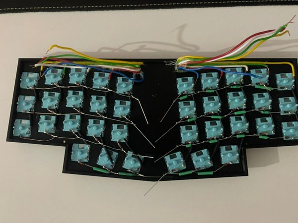

I needed to trim the printed case a little bit to place micro controller.

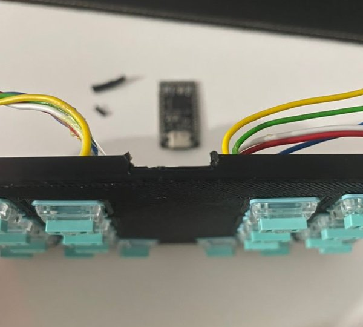

I used [splinky](https://github.com/plut0nium/0xB2) microcontroller for this keyboard.  
Splinky is `Pro-Micro/Elite-C replacement with USB-C and RP2040`

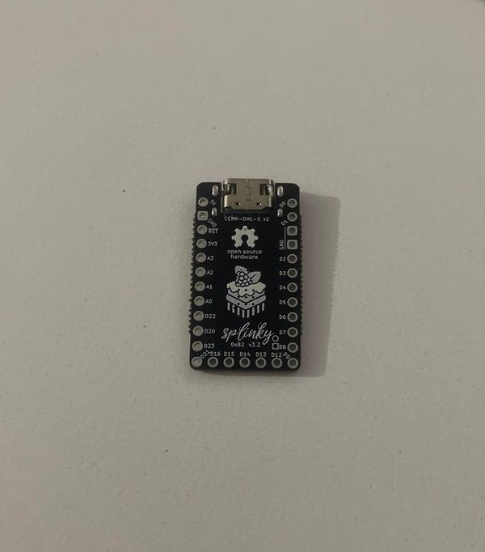

After placing the MCU to the board: 

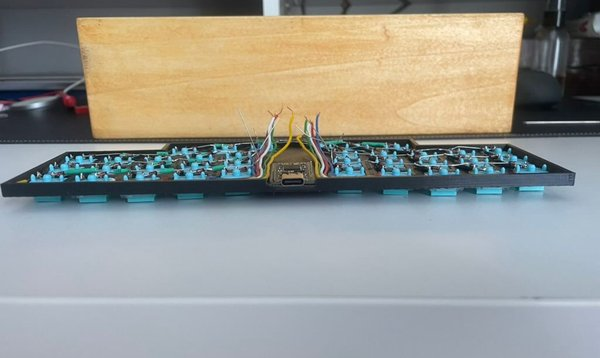

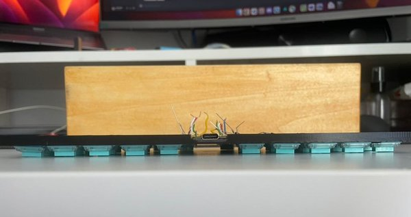

Huge shout out to my wife again, she soldered all wires to MCU. 

Let's talk about keycaps. I printed [this](https://www.printables.com/model/640140-mbk-choc-low-profile-keycaps).  

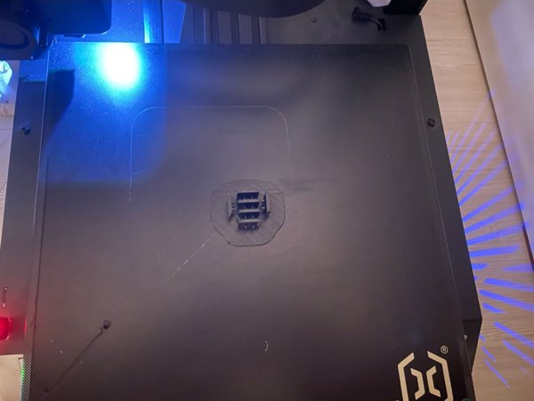

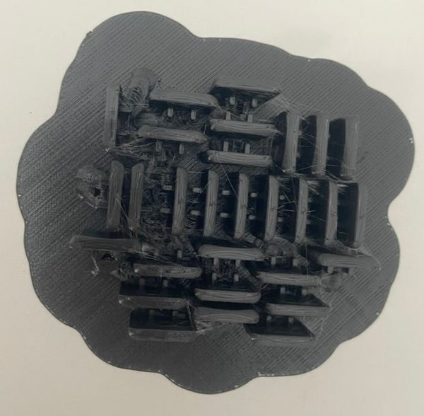

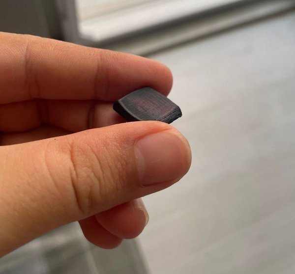

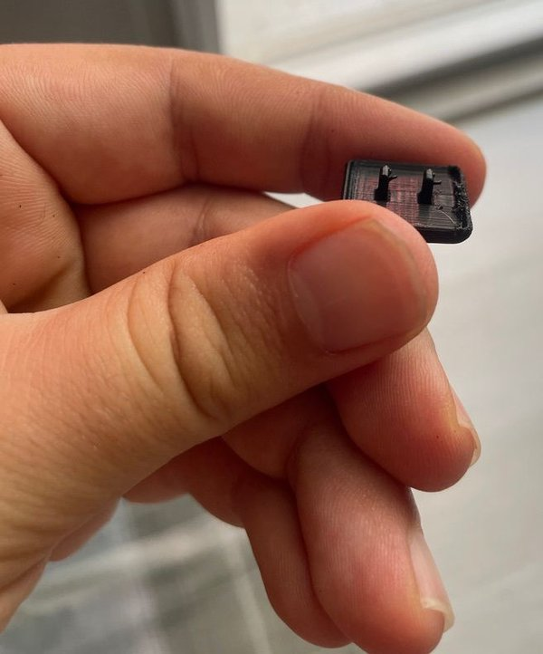

As you can see above, there are some burrs on keycaps. I put them into nail polish remover to remove burrs.

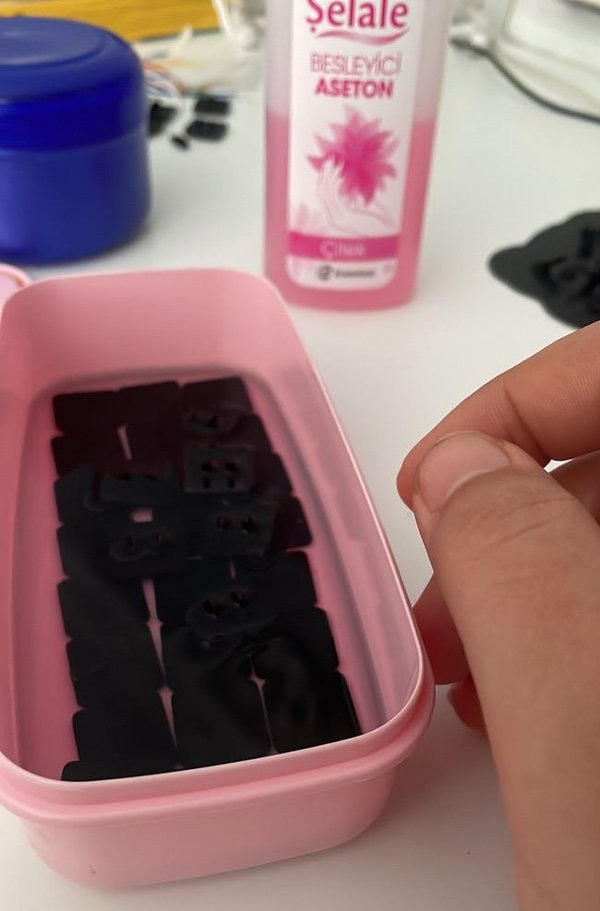

It also softened the keycaps a bit. I did not quite like the result. But not bad.

After a while, I took out the keycaps from nail polish remover. Then I put them into switches.

After mounting all keycaps, only a back case left to finish.  
A friend helped me with this. He prepared a plexiglass with exact measurements. 

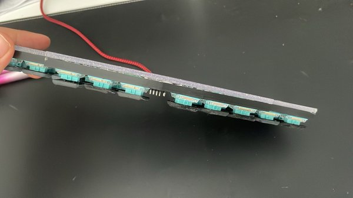
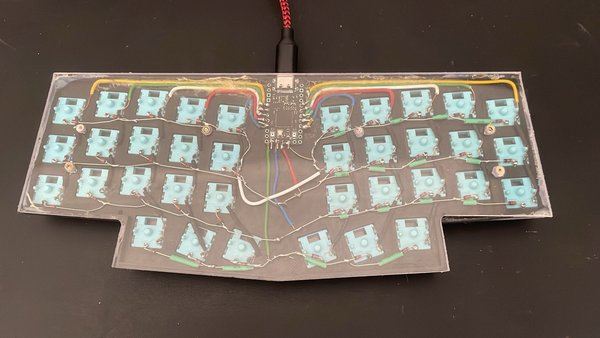

I hope it is helpful and/or fun to read. Thanks for reading. 

Said